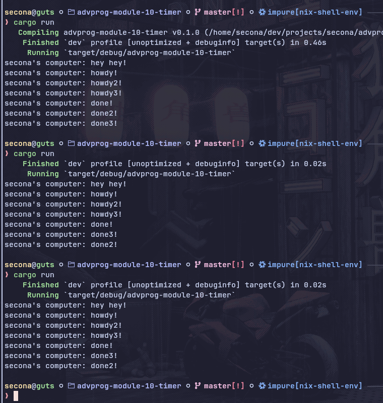
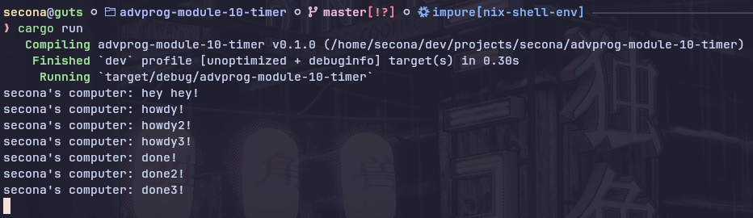

#### Experiment 1.2: Understanding how it works.

"hey hey!" is printed before "howdy!" because the statement to print "hey hey!" comes before the call to `executor.run()`. The `spawner.spawn()` function only queues the task onto the `task_sender` and it doesn't execute it immediately. The actual execution of the task (which prints "howdy!") begins when `executor.run()` is called, which happens after "hey hey!" is already printed.

---

#### Experiment 1.3.1 Multiple Spawn

When introducing three `spawner.spawn()` function calls, the program will print "howdy" and "done" three times. However, the order in which the "done" messages appear can vary between executions. This is because each spawned task sleeps on a separate thread with its own timer and scheduled independently. As a result, the "done" messages may be printed in different orders, depending on how the threads are scheduled and when they wake up.

#### Experiment 1.3.2 Removing Drop

After removing the `drop(spawner)` call, the program does not terminate even after all "done" messages are printed. This is because the spawner is still alive, so the executor's task channel remains open. As a result, the `executor.run()` loop continues waiting for new tasks and never exits, since it doesn't know that no more tasks will be sent.

