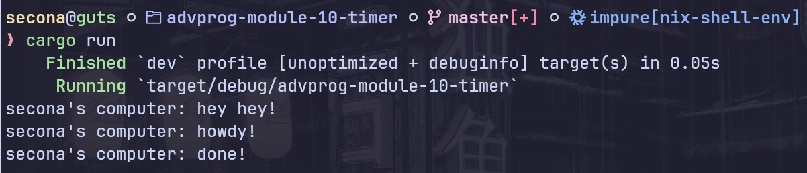

#### Experiment 1.2: Understanding how it works.

"hey hey!" is printed before "howdy!" because the statement to print "hey hey!" comes before the call to `executor.run()`. The `spawner.spawn()` function only queues the task onto the `task_sender` and it doesn't execute it immediately. The actual execution of the task (which prints "howdy!") begins when `executor.run()` is called, which happens after "hey hey!" is already printed.

---
